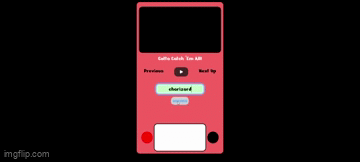

# A pokedex
This is a pokedex that makes api calls to the pokeapi! See images, type, a little description, and even hear their cry!

**Link to project:** https://abpokedex.netlify.app/

    

## How It's Made:

**Tech used:** HTML, CSS, & JavaScript

Where do I start? The PokeApi organizes their data in an interesting way, and as a result, I was able to practice making api calls within api calls. This allowed me to do something really interesting, depending on which error I recieved, 
it would affect the dom differently, I'll explain more about this in a moment. To start, the first call is made by 
taking the user input and converting it to lower case as all the pokemon in the pokeapi are lower case, this makes it possible for users to input lower case or upper case and regardless, get a result. Moving on, the first call sets us up 
with some interesting features. The "screen" is turned on if a result is found or it remains/turns black if one is not found. 
The first data we recieve from the api gives us images of the pokemon, a regular image and a shiny one, which are displayed within the 
"screen". We also recieve data about what kind of cry the pokemon has, this is available in the center of the pokedex for the users. This is where things start to get a little interesting. Another api call is made that will see which pokemon 
is before the current one, as well as which one comes next. There is logic in place to prevent a pokemon appearing before the very first pokemon, as well as pokemon appearing after the last one. Hear the phone ringing? Because we're making ANOTHER api call.
This time these calls are dependent on the length of the array that holds the data about the type of the pokemon we get from our original call. This logic exists to handle cases where we have one type or two types. Depending on that, one or two calls are made, 
two a url that is the index position of the type, there an image is recieved of the time and set to the dom, whether that be one types or two types. Our last call goes to a url that is dependent on data.id number of the pokemon. From there we are able to extract 
a text description of the pokemon. The error actions are set up in a way to introduce css styles to the dom depending on where the error is found. For example, if a pokemon is found, but there is no text description available to them, instead of documenting the entire
 call as an error, only the part where the text appears is affected. Users will get a message letting them know that there was no description for the pokemon, but we still get the image, cry, and type. Now if no pokemon is returned, as well as the screen turning black, 
 there are lights at the bottom of the pokedex, if nothing is returned, the red light is on and the green off, should something be returned, we get the green as opposed to the red.

## Optimizations

I could have done more with the data available to me. For example, I could have displayed the ID number of the pokemon in the pokedex as well as for the pokemon that come before and after. These before and after pokemon could also have had a image presented for them.
The poke api also included information on regional pokemon, mega forms, and gmax forms. How ever, how to access these pokemon isn't straight forward for users. I could implement a way that makes users aware of this information and to access it with (pokemon name)-(region)/(pokemon name)-(gmax). 
The audio also is returned in a format that is not accessible to apple products. I could have found a way to change the format so that it was available on more devices.

## Lessons Learned:

I have so much more confidence making api calls now. I learned about extracting data from the calls and really diving deep using . notation and []. I got to see a little bit more about using JavaScript to interact with not just my HTML but my CSS as well. I also 
used this app on different devices to actually get some testing about what it would be like on different devices. The format of the pokedex takes all these different devices into account.
